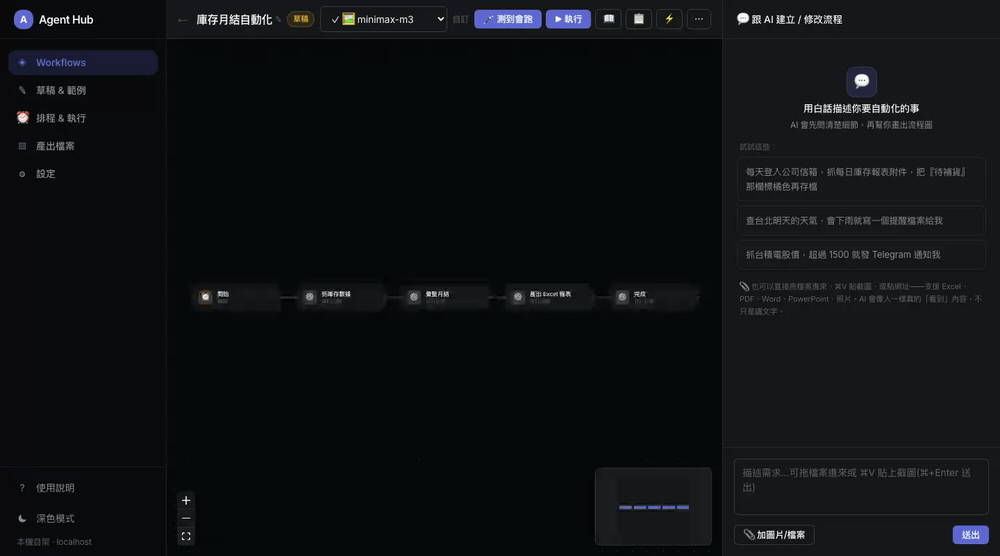
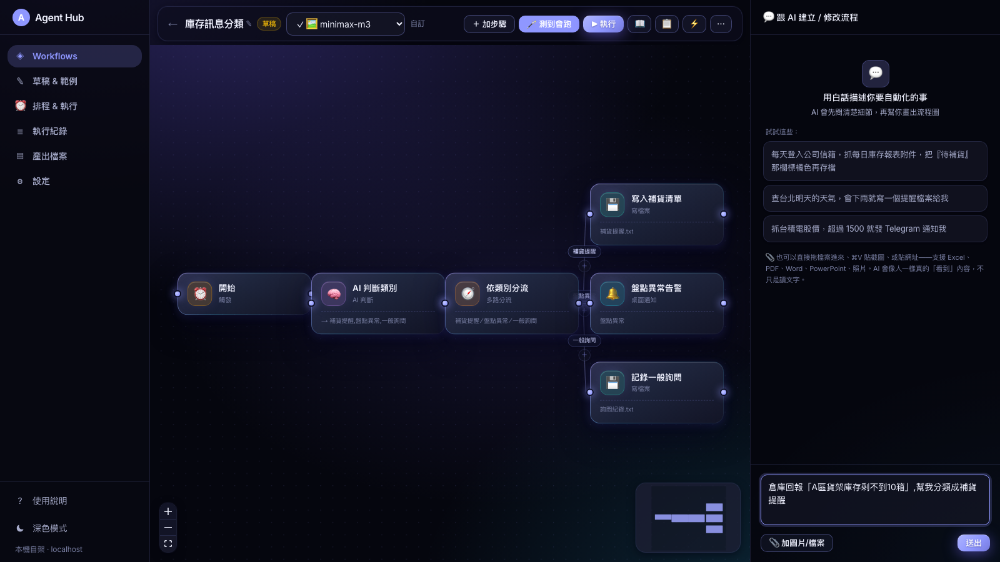
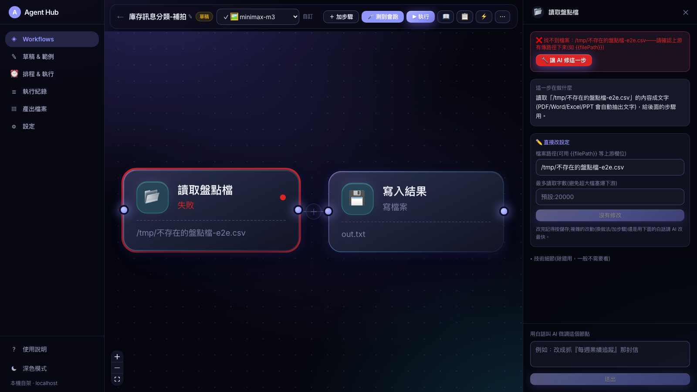
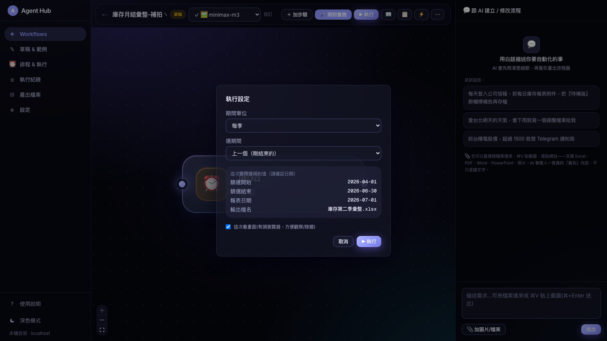
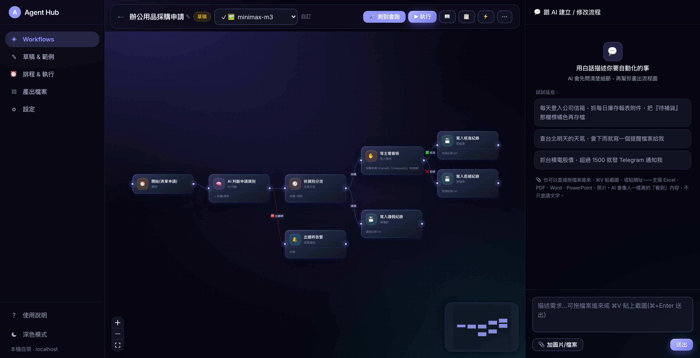
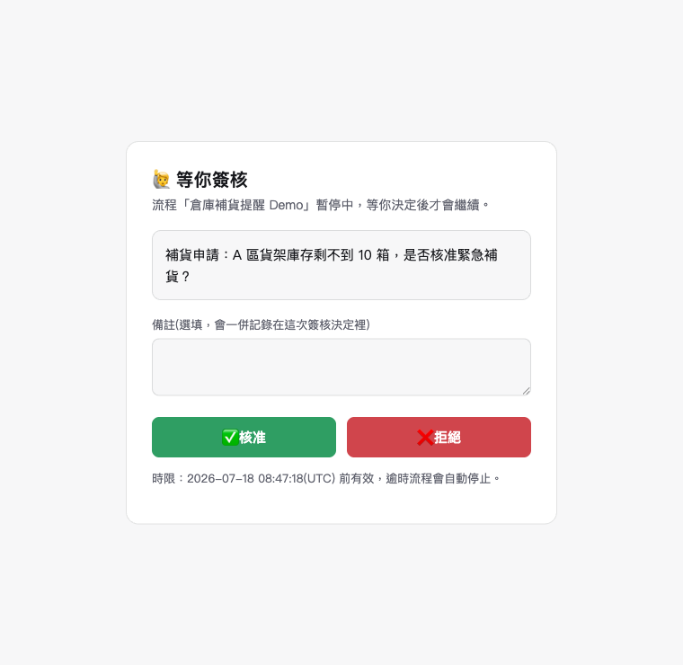
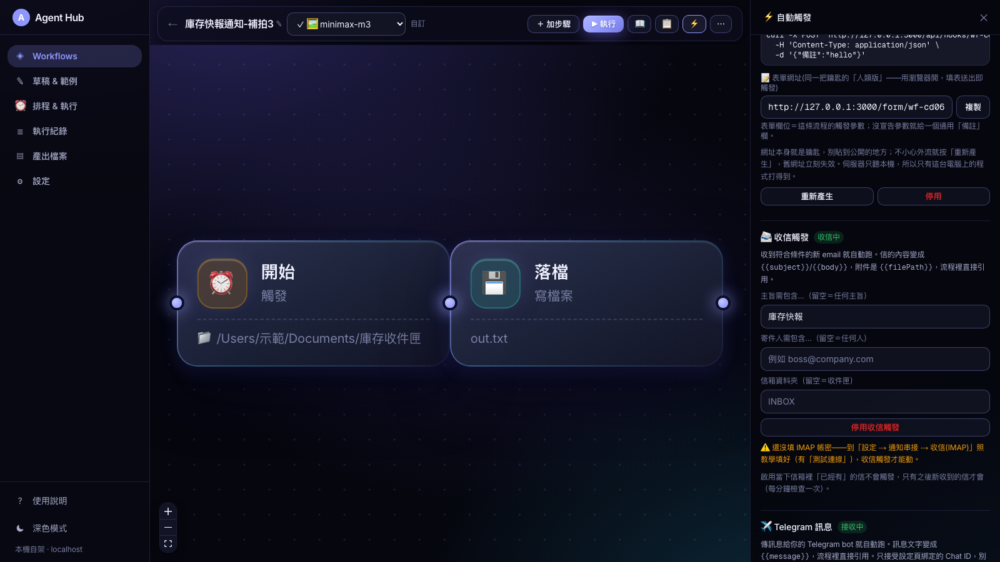

# Agent Hub 🤖

[](https://github.com/owen4sure/agent-hub/actions/workflows/ci.yml)

[繁體中文](./README.zh-TW.md) | **English**

A local-first visual workflow automation platform — **like n8n**, your task becomes a graph of nodes on a canvas, but **you build and modify everything by chatting with AI in plain language. You never write or read code.**



> The product UI is currently in Traditional Chinese. The screenshots below show the real product; captions explain what you're looking at.

## Core ideas

- **A workflow is a node graph**: every step is visible on the canvas (login → find email → download → process → save), and data flows between nodes.
- **Built by talking**: describe what you want in the AI chat panel → the AI asks clarifying questions first → then draws the node graph for you.
- **Reliable building blocks + an escape hatch**: login, email search, downloads, Excel, HTTP calls, conditions, AI decisions… are all pre-tested blocks. Only when no block fits does the AI write a "custom code" node — and you still never have to read the code.
- **Self-hosted, per person**: clone and run it on your own machine. Credentials and API keys live only in your local `data/` directory (gitignored).

## Quick start

```bash
npm install          # postinstall also downloads Playwright's Chromium
npm run doctor        # health check: Node version / browser / folder permissions, with fix instructions
npm run dev
```

Open http://127.0.0.1:3000 (bound to localhost only — other devices can't reach it).

> Using an AI coding tool like Claude Code? Just paste this repo's URL into it — following `AGENTS.md`, it will set up the environment, run the health check, and verify the app opens, no commands needed on your side.

1. On the **Settings** page, enter your model **API Key / Base URL** (any OpenAI-compatible endpoint), or set the environment variables `AGENT_HUB_API_KEY` / `AGENT_HUB_BASE_URL` (see `.env.example`). Credentials your workflows need (e.g. webmail) also go on the Settings page.
   - **Automatic fallback**: if this machine has Claude Code installed and logged in (the `claude` command works), then when your primary model (often a free/shared API) keeps failing after retries, Agent Hub **automatically** falls back to the local Claude Code CLI (using your Claude subscription) — flaky free services no longer take the whole workflow down. You can also pick "claude-code (local subscription)" as your primary model in the model dropdown.
2. From the home page, click **＋ New workflow** to enter the canvas, then tell the AI what you want in the right-hand panel.
3. The AI asks about details first, and only draws the node graph once everything is clear → you click **Apply** → the flow appears on the canvas.
4. Click **▶ Run**: each node lights up in real time as execution progresses. Click any node to inspect the data flowing through it, tweak it in plain language, or have the AI fix it when it fails.



## Building flows in plain language

- **Build**: describe your need in the chat panel (you can upload screenshots/documents to help the AI understand). If anything is unclear, the AI asks before drawing → you confirm and apply.
- **Manual editing is first-class too**: a "＋ Add step" drawer to browse every block, a "＋" on each edge to insert a step between two nodes, direct field editing on any node (change a URL or keyword without asking the AI), and Cmd/Ctrl-Z undo for every canvas edit. AI and manual modes work side by side.
- **Tweak one step**: click a node on the canvas → say "search for the XX email instead" → the AI edits just that node; each node card also shows its key settings (which URL, which cases, which filename) at a glance.
- **Self-repair on failure**: a node turns red → click "🔧 Let AI fix this step" → the AI reads the error and page screenshot and proposes a fix.
- **Add/remove steps**: tell the AI "add an email-sending step at the end" or "drop the notification step".
- **Standing preferences**: write your habits once on the Settings page ("always suffix filenames with today's date", "always notify via Telegram") — the AI honors them in every flow it builds, so you never repeat yourself.





## The AI carries 2,000+ real-world workflows in its head

The UI only ever shows *your* flows (it stays simple); the muscle lives in the AI's brain:

- **58 complete blueprints** — faithfully ported from the n8n community workflow library (Zie619/n8n-workflows) into this product's node format, each gated by deterministic lint in CI. When you describe a need in plain language, the AI first retrieves the closest blueprint and builds by imitation (same structure, your content) — a single sentence like "match incoming payments against my order sheet and alert me on mismatches" yields a correct 7-node graph with multi-way branching.
- **A local index of all 2,061 community workflows** — names, node combinations, and trigger shapes distilled into a local index the AI consults on every build; for any common automation it has a real-world shape to reference.

As your flows grow: the home page supports search and **groups** (work / personal…) with sectioned display, and the "☰ Runs" page shows every run across all workflows in one place.

## Node library (extensible)

Triggers, browser (login / find email / download attachment), data (Excel / string templates / PDF reading / zip extraction), files (read a file as text — PDF/Word/Excel/PPT auto-extracted — / write text files), integrations (HTTP requests / fetch a web page as text / read RSS feeds / **read a mailbox over IMAP (no browser)** / read a link-shared Google Sheet with zero auth / append rows to your Google Sheet via a 3-minute Apps Script deploy — no OAuth / send email over SMTP with attachments / Telegram / LINE / Slack / desktop notification), logic (if conditions / **multi-way switch** / **wait-for-human-approval** / repeat steps over a list / wait / run another workflow as a sub-flow / variables), AI (decide·generate / read images with a vision model), and custom code. Each node type is one file in `lib/workflow/nodes/*.ts` — add a file and the AI can use it immediately. Files uploaded to the AI (PDF, Word `.docx/.doc`, Excel `.xlsx/.xls`, PowerPoint `.pptx`, RTF, plain-text family) are converted to text server-side (`lib/textExtract.ts`); images and screenshots go through a vision model that truly *sees* the content (Excel colors/borders/layout, embedded charts, web pages) — not just extracted text.

## Human approval / Plan-B branches / resume from the failed step

- **Wait for approval**: a flow can pause mid-run for a real person to decide — "manager must approve", "confirm before publishing". Drop in a wait-approval node: the flow stops there, sends the question to your Telegram (message carries ✅ approve / ❌ reject buttons — decide from your phone), Email (with an approval link), or desktop notification, and an approval card appears on the home page. Approve continues down the "approved" branch, reject down "rejected"; it can wait hours or days, and times out honestly with a notification.
- **Failure branches (Plan B)**: any step can have a red dashed "on error" edge — if that step fails, the run doesn't collapse; it takes your pre-drawn fallback (switch to a backup source, send an alert…), with `{{error}}`/`{{errorStep}}` available downstream. You can also set "run another workflow when this one fails" in the ⚡ trigger panel as a global safety net.
- **Resume from the failed step**: when a long flow fails midway, fix the step and hit "resume from the failed step" on the run record — everything that already succeeded is reused, only the failed step and what follows re-runs (steps needing a live browser session honestly re-run their login chain).





## Triggers: schedule / folder watch / webhook / email / Telegram / LINE

Besides clicking ▶ Run, every workflow has a ⚡ trigger panel with six ways to run itself:

- **Schedule**: daily / monthly / quarterly on Jan-Apr-Jul-Oct / weekly / raw cron — the whole graph triggers automatically (headless), computing "last period" dates for you.
- **Folder watch**: point the workflow at a folder; any new file dropped in triggers a run within seconds, with `{{filePath}}` / `{{fileName}}` available to downstream nodes ("drop the report in the inbox folder and it processes itself"). Files already in the folder when you enable watching are ignored; only new arrivals trigger. Watching applies to *production* workflows only, so a draft you're still editing never fires in the background.
- **Web form**: enabling the webhook also gives you a form URL — anyone you share it with fills a ready-made web form (fields = the flow's trigger parameters) and submits to trigger the flow. The human-friendly twin of the webhook.
- **Webhook**: enable it to get a private URL (the random token in the URL is the credential). Any local tool — a phone shortcut relaying through your Mac, a script, another app — POSTs JSON to it and the fields become `{{field}}` variables in the flow. Regenerate the URL anytime to revoke the old one.
- **Email (IMAP)**: "when an email like this arrives, run" — the engine polls your inbox once a minute over IMAP (no browser, no CAPTCHA); a new mail matching your subject/sender filters triggers a run with `{{from}}` / `{{subject}}` / `{{body}}` available downstream, and attachments saved to disk as `{{filePath}}`. Mails already in the inbox when you enable it never fire; production workflows only. IMAP credentials live on the Settings page with a one-click connection test (Gmail: `imap.gmail.com` + the same app password as SMTP). There's also a standalone **read-mailbox node** to fetch the latest matching mail mid-flow.
- **Telegram message**: text your bot and the flow runs, with `{{message}}` downstream — add a keyword filter ("記帳…") so several flows can share one bot. Locked to the Chat ID bound on the Settings page: strangers who find your bot can't trigger anything. Production workflows only.
- **LINE message**: message your LINE Official Account and the flow runs (`{{message}}` / `{{userId}}` / `{{replyToken}}`). Two locks: a random token in the webhook URL *and* an `X-Line-Signature` check against your Channel Secret. Heads-up: LINE's platform can only call a public HTTPS URL, so you need a tunnel (`cloudflared` / `ngrok`, instructions in the panel) until the built-in secure remote mode ships.

Unattended runs (every trigger type) report success/failure via desktop notification — you'll know something broke without opening the app.

Schedules and watchers need the engine running; install it as a daemon so it survives reboots:

```bash
scripts/install-daemon.sh     # launchd daemon, starts on boot (macOS)
scripts/uninstall-daemon.sh
```



**Schedules don't fire while the computer is off or asleep** (an inherent limit of local-first).

**Failed scheduled runs come with a fix, pre-baked**: when a production workflow fails on schedule, you get a desktop notification while the AI works out a repair in the background. Open the home page, see the "AI has a fix ready" card, click "✅ Apply & re-run" — no debugging on your side. Applying auto-backs-up first; you can always restore from the workflow's Versions panel.

## Export / import (sharing with colleagues)

A workflow exports to a single `.agenthub-workflow.json` (credentials excluded). A colleague imports it as a draft and just fills in their own credentials.

## Repository layout

```
app/workflows/[id]/     ★ canvas + AI chat (main screen)
app/{,drafts,files,settings,schedules}/
lib/workflow/
  types.ts registry.ts        node contract + node library registry
  engine.ts                    execution engine (topological run / shared browser / retry / crash recovery)
  builder.ts nodeEditor.ts     AI graph building (clarify-first) / AI node editing
  repair.ts                    shared repair logic for autofix (one node) and autorun (test drafts until they pass)
  fixProposals.ts              background fix proposals for failed scheduled runs (one-click apply & re-run)
  learnedFixes.ts              remembered fixes, applied directly when similar errors recur
  explain.ts                   translates the whole graph into plain-language steps
  store.ts                     workflows stored as data/workflows/*.json, with version backup/restore (history/)
  nodes/*.ts                   one file per node type
lib/aiRetry.ts                 model-call retry (backoff + empty responses count as failures) + Claude Code fallback
lib/claudeCodeClient.ts        when all free models fail, falls back to the local claude CLI
lib/textExtract.ts             server-side text extraction for uploaded files (Excel/PDF/Word/RTF)
lib/scheduler.ts               scheduling (cron matching / next_run_at / catch-up runs)
lib/watchers.ts                folder-watch trigger (10s scan, DB-claimed dedup, silent seeding of pre-existing files)
lib/webhookStore.ts            webhook token management (constant-time compare); endpoint at app/api/hooks/
lib/mailClient.ts               shared IMAP layer (imapflow + mailparser): credentials, filters, fetch/parse
lib/mailWatcher.ts              email trigger (60s IMAP poll, same claim/seed discipline as folder-watch)
lib/telegramPoller.ts          single Telegram getUpdates consumer: approval buttons + message trigger
lib/lineHook.ts                 LINE webhook token + X-Line-Signature verification; endpoint at app/api/line-hooks/
lib/notify.ts                  desktop notifications for schedule success/failure (macOS)
data/                          local state (gitignored): DB, workflows, debug screenshots, output files
docs/ARCHITECTURE_V2.md        the original design document (partially outdated; code and this README win)
```

## Development

```bash
npm run test    # unit tests for core logic (relative-date resolution, graph lint, JSON extraction, cron, folder-watch rules — pure functions)
npm run lint    # ESLint
node scripts/regression.mjs [from to]  # complex-request regression suite: representative plain-language cases, built by the AI for real and structurally verified (consumes model quota; run manually before releases)
```

## Security

- **No keys in code**: read from `.env` (`AGENT_HUB_API_KEY`, gitignored) or the Settings page; never committed.
- `data/` is fully gitignored; credentials are stored in plaintext in local SQLite (same trust model as a browser's saved passwords) — don't sync it to the cloud.
- The AI always shows a preview for you to confirm before building or editing the graph, and auto-backups make everything restorable.
- **This is a single-user local tool, bound to `127.0.0.1` by default** (`npm run dev` / `npm run start` both pass `-H 127.0.0.1`). **Do not change it to `-H 0.0.0.0` or host it publicly** — the `custom-code` node (AI-written custom steps) and the `http-request` node execute code / reach arbitrary URLs on your machine, so exposing them is equivalent to RCE/SSRF.
- **Built-in cross-site protection** (`proxy.ts`): binding to 127.0.0.1 alone can't stop a malicious web page from making your own browser send requests to localhost. All `/api` requests verify the Host header (against DNS rebinding), and non-GET requests additionally require a local Origin — cross-site requests from external sites get 403.
- **The `custom-code` node runs AI-generated code on your machine with your user permissions** — that's the nature of the "AI writes a custom step for you" feature. The code is visible before you apply it; if a workflow doesn't feel trustworthy, don't use custom-code nodes in it.
- **Webhook URLs are credentials**: the random token in the path is compared in constant time, and a wrong token returns the same 404 as a nonexistent workflow (no probing). Since the server only listens on 127.0.0.1, only programs on this machine can reach a webhook at all.
- **Model fallback**: your configured (often free) API is primary; only when the whole retry chain fails does the local Claude Code CLI step in once (see `lib/aiRetry.ts`) — it's not called on every request and incurs no surprise costs.
- License: MIT (see `LICENSE`).
